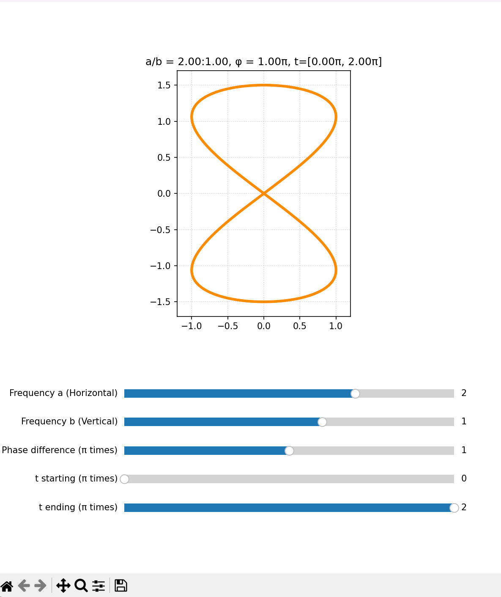
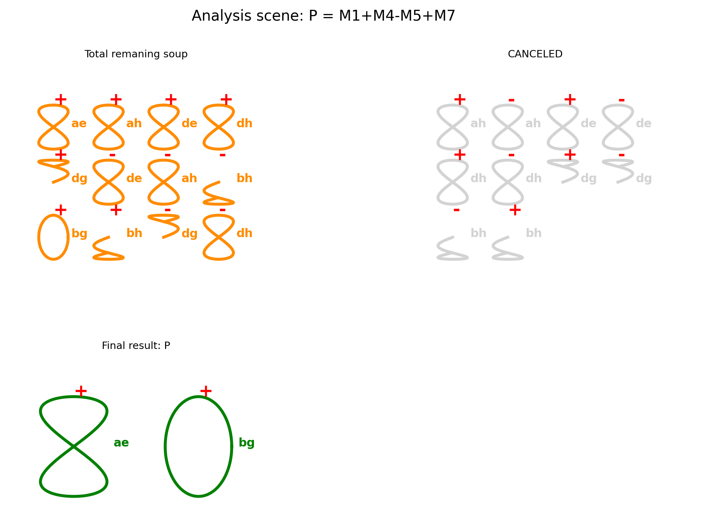
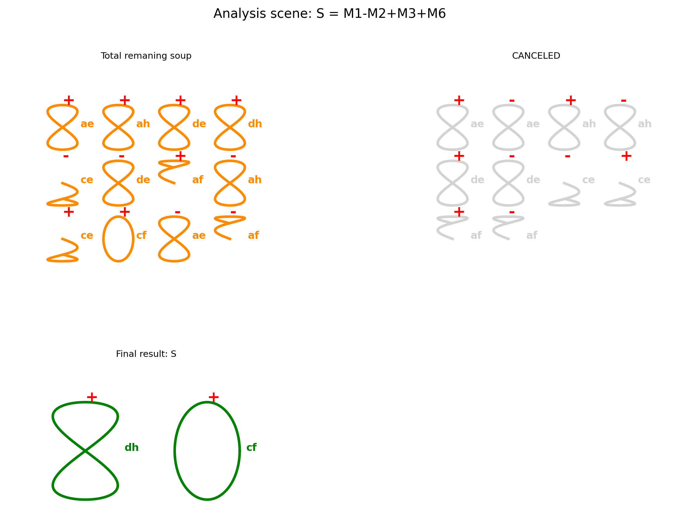

<div align="center">
  <h1>Project: Lastik</h1>
  <h2>The Lost Geometry of Matrix Multiplication</h2>
  <h3><em>"We have an appointment beyond the horizon."</em></h3>
</div>

<div align="center">
  <a href="#english-version">English</a> • <a href="#türkçe-versiyon">Türkçe</a>
</div>
<br>

<a name="english-version"></a>
## English Version

> "This is a path from frequencies to topology, from there to matrices, and from there to computation."

### Summary

This project tackles one of the most famous problems in theoretical computer science—the optimization of matrix multiplication—with a completely new and intuitive approach. Building upon Strassen's revolutionary 1969 algorithm, which first broke the O(n³) complexity barrier, this project aims to translate its algebraic steps into a visual and geometric language.

At the heart of this endeavor is a unique visual notation I call "Lastik" (Turkish for "elastic" or "rubber band"), designed to represent matrices and their operations. This notation is mathematically rooted in the rich and elegant geometry of Lissajous curves.

This repository contains a Python engine that visualizes each step of the Strassen algorithm—the creation of the "soup of artifacts," the annihilation of oppositely charged terms, and the emergence of the final result—all within the "Lastik" language. The primary goal is to first express Strassen's algorithm in this new language. The ultimate goal is to leverage this visual analysis to uncover hidden patterns and, perhaps, to design a new, more efficient "Collision Geometry" that surpasses it.

### The Genesis: An Intellectual Odyssey

This project was not born from a single formula, but from a multi-stage journey of discovery.

**The Spark: Matrices as Graphs** The journey began with the intuitive idea of representing matrices not as static arrays of numbers, but as dynamic, graph-like structures I called "Lastiks". On a whiteboard, a 2x2 matrix was sketched as a holistic figure: two main nodes representing the diagonal elements (a, d), connected by two directed paths representing the off-diagonal elements (b, c). The key insight was that this was not four separate components, but a single, continuous, twisted loop with an "infinite flow".
* This geometric representation led to the discovery of a precise, mechanical method for multiplying two 2x2 matrices graphically, defined by two fundamental rules:
    1. **The Forward Diagonal Rule:**  To calculate an element on the main diagonal of the result (e.g., p = ae + bg), a two-part calculation was performed: first, the corresponding nodes from both Lastiks were multiplied (a * e). Second, the outgoing path from the first node was multiplied by the corresponding incoming path from the second Lastik (b * g). The sum of these two products yielded the correct diagonal element.
    2. **The Reverse Diagonal Rule:** To calculate an off-diagonal element (e.g., q = af + bh), a specific 'cross-interaction' was defined: the node of the first Lastik was multiplied by the opposite path of the second (a * f), and the path of the first Lastik was multiplied by the opposite node of the second (b * h). Their sum produced the correct off-diagonal element.
* Amazingly, this set of graphical rules perfectly replicated the algebraic results of standard matrix multiplication. This crucial validation proved that the geometric intuition was sound and paved the way for the next great challenge: applying this new visual language to the complexities of Strassen's algorithm.

**The Giant: Applying Strassen's Algorithm** The next step was to see if this graphical method could be accelerated. This led to applying Strassen's algorithm, attempting to translate its 7 intermediate products (M1 to M7) into the graphical "Lastik" notation.
  * A direct translation of Strassen's seven products into this graphical language required a crucial evolution of the "Lastik" concept. Strassen's genius wasn't just in finding seven multiplications; it was in the clever pre-addition and subtraction of matrix elements to form the terms to be multiplied.
    To represent these algebraic sums and differences, such as (a+d) or (f-h), the concept of charge was introduced to the Lastik notation. Each component of the Lastik (a, b, c, d) could now exist in one of three states:
    - Positive Charge (+): The component is active, like a "peak."
    - Negative Charge (-): The component is active with an opposite sign, like a "trough."
    - Neutral (0): The component exists within the structure but is considered "inactive" for the current operation.
  * This allowed me to represent complex molecular structures within a single Lastik figure. For example, the term (c-a) could now be visualized as a single "A" Lastik where the 'c' path is activated with a + charge and the 'a' node is simultaneously activated with a - charge. This principle of charge is precisely how Strassen tuned his terms, creating the initial     "soup of artifacts" where products like +ah and -ah could coexist, setting the stage for their eventual, elegant annihilation.

**The Leap: Penrose Diagrams & Tensors** The attempt to formalize the "Lastik" notation led to the discovery of Penrose Diagrams. This was a critical leap, revealing that my intuitive "Lastik" was an attempt to understand the world of Tensors. The project's scope expanded: I was no longer just drawing graphs; I was exploring tensor contractions.

**The Breakthrough: The Music of Lissajous Curves** The true nature of the "Lastik" shape remained elusive until a breakthrough discovery: Lissajous Curves. The elegant shapes produced by the superposition of two sine waves at different frequencies and phases were the mathematical DNA of my intuitive drawings.

**Mastering the Language: The Critical Phase Touch** Discovering the curves wasn't enough; I had to learn to control them. The key insight was understanding that three parameters are the "control knobs" of this geometry: the frequency ratio ($a/b$), the phase shift ($\phi$), and the time interval ($t$). The most crucial touch was realizing that a phase shift of $\phi = \pi/2$ (90 degrees) was the magic key that transformed chaotic open paths into the stable, symmetrical, and closed shapes that formed the core of my alphabet (like the perfect circle for G_node). This turned abstract math into a predictive, creative tool.

**The Forge: Building the Labs** `lissajous-lab.py`: The creation of the interactive "Lissajous Deciphering Console." This was my laboratory, an indispensable tool for discovering the precise parameters for every shape in my visual alphabet.

**The Symphony: The Final Engine (lastik.py)** This is the place where the real work is done. This engine integrates all insights from the journey. Its logic is threefold:
1.  A "Genome Database" stores the deciphered Lissajous recipes for each shape.
2.  An "Algebraic Engine" computes the results of Strassen's steps in the abstract "Lastik" language.
3.  A "Visualization Engine" acts as a compiler, translating the algebraic results into flawless geometric shapes by fetching their recipes from the database.

> "The main goal is to surpass Strassen, but first, we needed to be able to express it. Now, it can be expressed."

### Visuals: Milestones of the Journey
**Initial Whiteboard Sketches:**


**Interactive Lab Screenshot:**



**Final Engine Analysis Scene (P, Q, R, S):**





### How to Run

1.  Install the required libraries:
    ```bash
    pip install matplotlib numpy
    ```
2.  Run the main Python file (`lastik.py`).
3.  Inside the `if __name__ == "__main__":` block, you can uncomment the desired analysis functions (`visualize_P()`, `visualize_Q()`, etc.) to run them.

### Future Steps: Beyond the Horizon

This project is not an end, but a beginning. The tasks ahead are:

1.  **Pattern Recognition:** To meticulously study the generated scenes, searching for hidden symmetries in Strassen's algorithm.
2.  **Optimization:** To use these patterns to design a new "Collision Physics" that produces the same result with, perhaps, only 6 intermediate products instead of 7.
3.  **Generalization:** To extend this engine and philosophy to handle 3x3 and nxn matrices.

<br>

<a name="türkçe-versiyon"></a>
## Türkçe Versiyon

> "Frekanslardan topolojiye, oradan matrislere, oradan da hesaplamaya giden bir yol bu."

### Özet

Bu proje, teorik bilgisayar biliminin en meşhur problemlerinden biri olan matris çarpımının optimizasyonunu, tamamen yeni ve sezgisel bir yaklaşımla ele alır. Strassen'in 1969'da matris çarpımını $O(n³)$ karmaşıklığının altına indiren devrimsel algoritmasını temel alarak, bu cebirsel adımları görsel ve geometrik bir dile tercüme etmeyi hedefler.

Projenin kalbinde, "Lastik" adını verdiğim, matrisleri ve onların operasyonlarını temsil etmek için geliştirilmiş özgün bir görsel notasyon yatar. Bu notasyon, matematiksel olarak Lissajous eğrilerinin zengin ve zarif geometrisine dayanır.

Bu depo, Strassen algoritmasının her bir adımını ("artıklar çorbası"nın oluşumu, zıt yüklü terimlerin birbirini iptal etmesi ve nihai sonucun doğuşu), bu "Lastik" dilinde, adım adım görselleştiren bir Python motoru içerir. Asıl hedef, önce Strassen algoritmasını bu yeni dilde ifade edebilmektir. Nihai hedef ise, bu görsel analizler aracılığıyla Strassen'in algoritmasındaki gizli örüntüleri keşfetmek ve belki de onu aşacak yeni, daha verimli bir "Çarpışma Geometrisi" tasarlamaktır.

### Yolculuk: Bu Projenin Doğuş Hikayesi

Bu proje, tek bir formülden değil, çok aşamalı bir keşif yolculuğundan doğdu.

**Kıvılcım: Matrislerin Graf Olarak Yorumlanması** Yolculuk, matrisleri statik sayı dizileri olarak değil, "Lastik" adını verdiğim dinamik, graf benzeri yapılar olarak temsil etme sezgisiyle başladı. Beyaz tahta üzerinde 2x2'lik bir matris, bütünsel bir figür olarak çizildi: diyagonal elemanları (a, d) temsil eden iki ana düğüm ve bu düğümleri birbirine bağlayan, diyagonal olmayan elemanları (b, c) temsil eden iki yönlü yol. Kilit içgörü, bunun dört ayrı bileşen değil, "sonsuz bir akışa" sahip, tek ve bükülmüş bir döngü olduğuydu.
* Bu geometrik temsil, 2x2'lik iki matrisi grafiksel olarak çarpmak için, iki temel kural tarafından tanımlanan, mekanik ve kesin bir yöntemin keşfine yol açtı:
    1. **Düz Diyagonal Kuralı:** Sonuç matrisinin ana diyagonelindeki bir elemanı (örneğin p = ae + bg) hesaplamak için, iki adımlı bir işlem tanımlandı: İlk olarak, her iki Lastik'teki karşılık gelen düğümler çarpılırdı (a * e). İkinci olarak, ilk Lastik'teki düğümden giden yol, ikinci Lastik'teki karşılık gelen gelen yolla çarpılırdı (b * g). Bu iki çarpımın toplamı, doğru diyagonal elemanı veriyordu.
    2. **Ters Diyagonal Kuralı:** Diyagonal olmayan bir elemanı (örneğin q = af + bh) hesaplamak için ise, spesifik bir 'çapraz etkileşim' kuralı uygulandı: ilk Lastik'in düğümü, ikincinin karşı yoluyla (a * f); ilk Lastik'in yolu ise ikincinin karşı düğümüyle çarpılırdı (b * h). Bu iki sonucun toplamı, doğru ters diyagonal elemanı oluşturuyordu.
* Şaşırtıcı bir şekilde, bu grafiksel kurallar bütünü, standart matris çarpımının cebirsel sonuçlarını birebir kopyaladı. Bu hayati doğrulama, geometrik sezginin sağlam olduğunu kanıtladı ve bir sonraki büyük meydan okumaya, bu yeni görsel dili Strassen'in karmaşık yapısına uygulamaya zemin hazırladı.

**Devle Karşılaşma: Strassen Algoritmasının Uygulanması** Bir sonraki adım, bu grafiksel yöntemin hızlandırılıp hızlandırılamayacağını görmekti. Bu, beni Strassen'in algoritmasına ve onun 7 ara çarpımını (M1'den M7'ye) "Lastik" notasyonuna çevirme çabasına yönlendirdi.
  * Strassen'in yedi çarpımını doğrudan bu grafiksel dile çevirmek, "Lastik" konseptinde hayati bir evrimi gerektirdi. Strassen'in dehası, sadece yedi çarpım bulmasında değil; asıl sihri, çarpılacak terimleri oluşturmak için matris elemanlarını akıllıca önceden toplayıp çıkarmasındaydı.
    (a+d) veya (f-h) gibi bu cebirsel toplamları ve farkları geometrik olarak temsil edebilmek için, Lastik notasyonuna yük kavramı dahil edildi. Artık Lastik'in her bir bileşeni (a, b, c, d), üç durumdan birinde var olabiliyordu:
    - Pozitif Yük (+): Bileşen aktiftir, bir "tepe" gibidir.
    - Negatif Yük (-): Bileşen zıt işaretle aktiftir, bir "çukur" gibidir.
    - Nötr (0): Bileşen yapının bir parçasıdır, ancak o anki işlem için "etkisiz" kabul edilir.
 * Bu, tek bir Lastik figürü içinde karmaşık moleküler yapılar oluşturmamı sağladı. Örneğin, (c-a) terimi, artık, 'c' yolunun + yükle ve aynı anda 'a' düğümünün - yükle aktive edildiği tek bir "A" Lastiği olarak görselleştirilebiliyordu. Strassen'in terimlerini akıllıca ayarlamasının sırrı tam olarak bu yük prensibidir. Bu ilke, +ah ve -ah gibi parçacıkların          bir arada var olabildiği o ilk "artıklar çorbasını" yaratarak, onların en sonunda gerçekleşecek olan o zarif "iptal" anına zemin hazırladı.

**Sıçrama: Penrose Diyagramları ve Tensörler** "Lastik" notasyonunu formelleştirme girişimi, Penrose Diyagramları'nın keşfiyle sonuçlandı. Bu, sezgisel "Lastik" metaforumun aslında Tensörler dünyasını anlama çabası olduğunu ortaya çıkaran kritik bir sıçramaydı. Projenin kapsamı genişledi: artık sadece graf çizmiyordum; tensör kontraksiyonlarını araştırıyordum.

**Büyük Keşif: Lissajous Eğrilerinin Müziği** "Lastik" şeklinin gerçek doğası, projeyi değiştiren o büyük keşfe kadar bir sır olarak kaldı: Lissajous Eğrileri. İki basit sinüs dalgasının farklı frekans ve fazlarla birleşerek yarattığı bu zarif şekiller, benim sezgisel çizimlerimizin matematiksel DNA'sıydı.

**Dile Hakim Olmak: O Kritik Faz Dokunuşu** Eğrileri bulmak yeterli değildi; onları kontrol etmeyi, onlarla konuşmayı öğrenmem gerekiyordu. Bu geometrinin "kontrol düğmelerinin" üç temel parametre olduğu anlaşıldı: frekans oranı ($a/b$), faz farkı ($\phi$) ve zaman aralığı ($t$). En can alıcı dokunuş ise, $\phi = \pi/2$ (90 derece)'lik bir faz farkının, kaotik açık yolları, alfabemin temelini oluşturan (mükemmel bir çember gibi) kararlı, simetrik ve kapalı şekillere dönüştüren sihirli anahtar olduğunu fark etmekti. Bu, soyut matematiği, öngörülebilir ve yaratıcı bir araca dönüştürdü.

**Demir Dövülürken: Laboratuvarların İnşası** `lissajous-lab.py`: İnteraktif "Lissajous Deşifre Konsolu"nun yaratılışı. Bu laboratuvar, görsel alfabemdeki her bir şeklin hassas parametrelerini keşfetmek için vazgeçilmez bir araç oldu.

**Senfoni: Nihai Motor (lastik.py)** Bu, asıl işin yapıldığı yerdir. Önceki tüm adımların doruk noktası olan bu motor, yolculuk boyunca kazanılan derin içgörüleri birleştirir. Mantığı üç katmanlıdır:
1.  Bir "Genom Veritabanı", deşifre edilmiş Lissajous tariflerini saklar.
2.  Bir "Cebirsel Motor", Strassen'in adımlarını soyut "Lastik" dilinde hesaplar.
3.  Bir "Görselleştirme Motoru", bir derleyici gibi çalışarak cebirsel sonuçları alır ve veritabanından tariflerine bakarak onları kusursuz geometrik şekillere tercüme eder.

> "Asıl hedef Strassen'I aşmak fakat önce ifade edebilmek gerek. Artık ifade edilebiliyor."

### Görseller: Yolculuğun Kilometre Taşları
**İlk Beyaz Tahta Çizimleri:**


**Laboratuvarların Ekran Görüntüleri**


**Sonuçlar (P, Q, R, S):**


### Nasıl Çalıştırılır?

1.  Gerekli kütüphaneleri yükleyin:
    ```bash
    pip install matplotlib numpy
    ```
2.  Ana Python dosyasını (`lastik.py`) çalıştırın.
3.  Kodun içindeki `if __name__ == "__main__":` bloğunda, `visualize_P()`, `visualize_Q()` gibi fonksiyonların yorum satırlarını kaldırarak istediğiniz analizi çalıştırabilirsiniz.

### Gelecek Adımlar: Ufkun Ötesi

Bu, bir son değil, bir başlangıçtır. Önümüzdeki görevler şunlardır:

1.  **Örüntü Arama:** Üretilen P, Q, R, S sahnelerini dikkatle inceleyerek, Strassen'in algoritmasındaki gizli simetrileri ve desenleri aramak.
2.  **Optimizasyon:** Bu desenlerden yola çıkarak, "Bu savaşı daha az kayıpla (daha az çarpımla) kazanmanın bir yolu var mı?" sorusuna cevap aramak. 7 M terimi yerine, belki de 6 ara ürünle aynı sonucu veren yeni bir "Çarpışma Fiziği" tasarlamak.
3.  **Genişleme:** Bu motoru ve felsefeyi, 3x3 ve nxn matrislere uygulayacak şekilde genelleştirmek.

